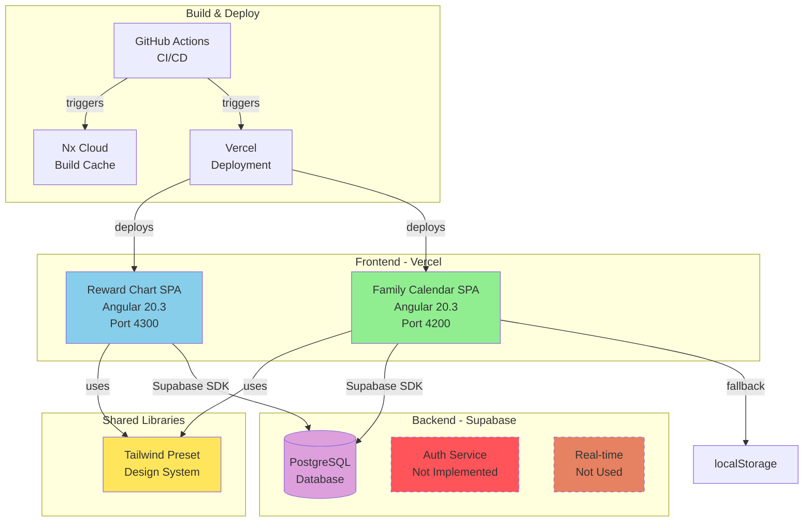
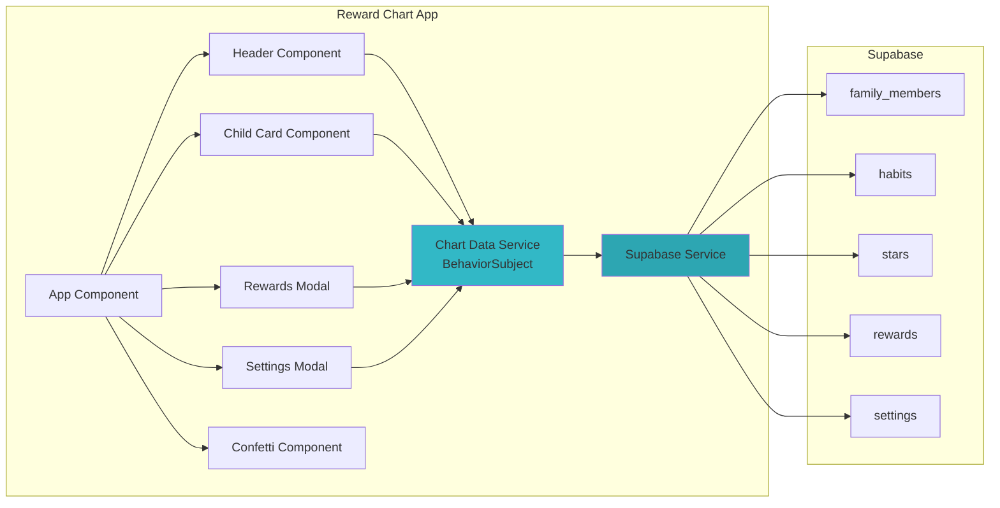
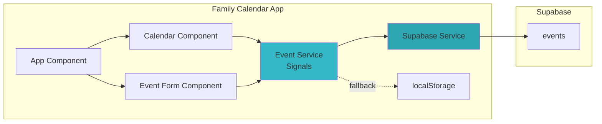
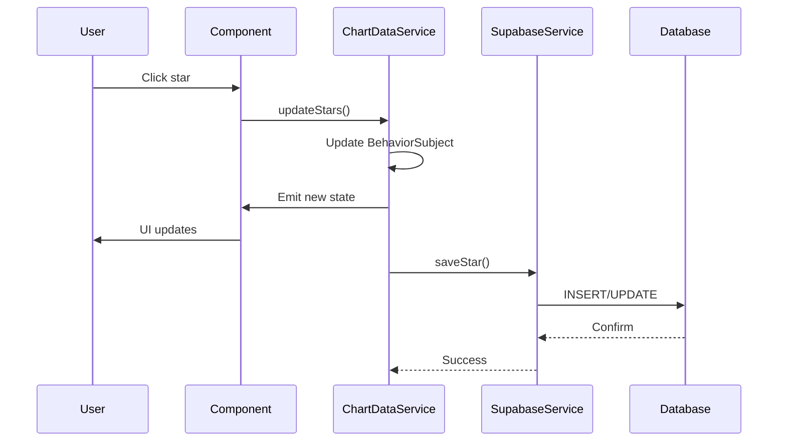
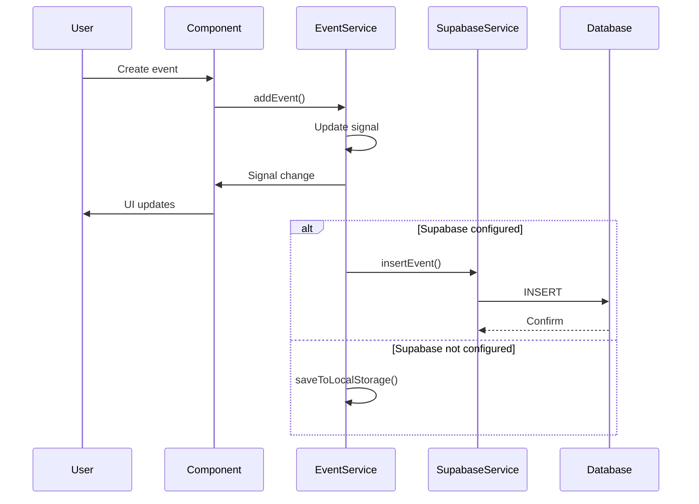
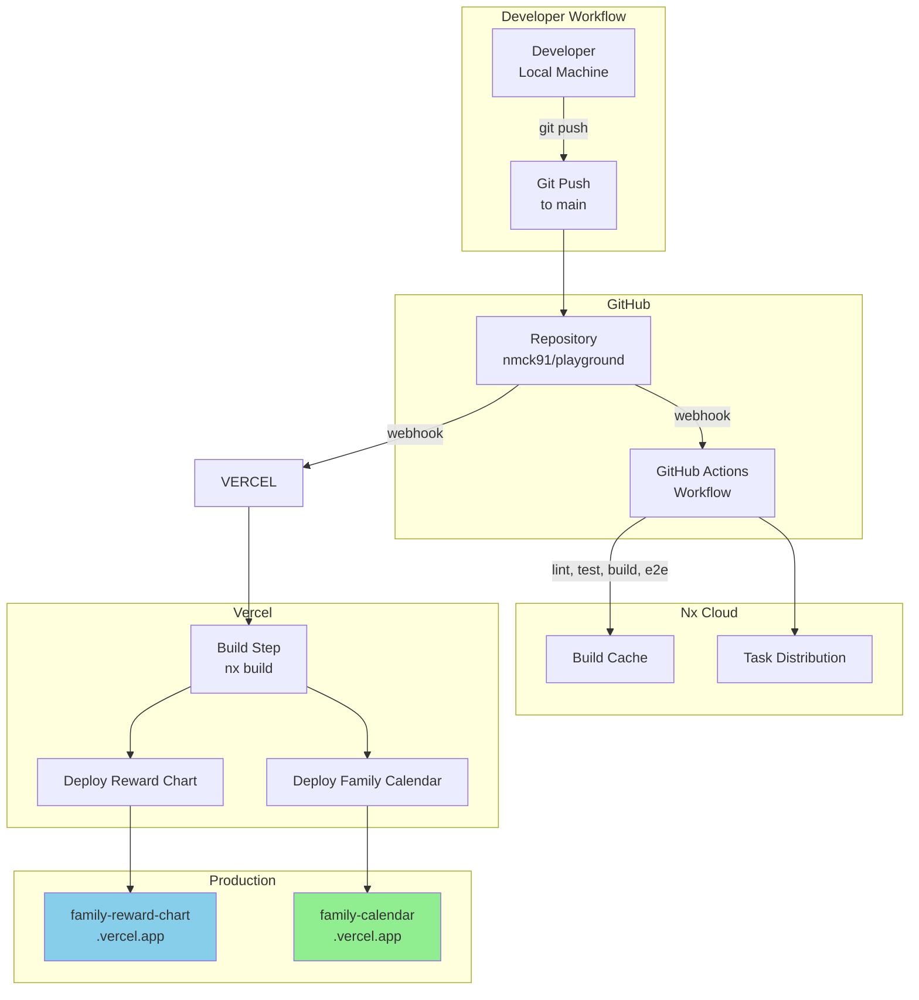
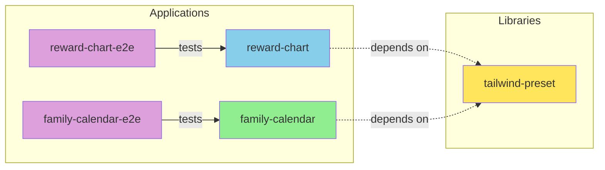
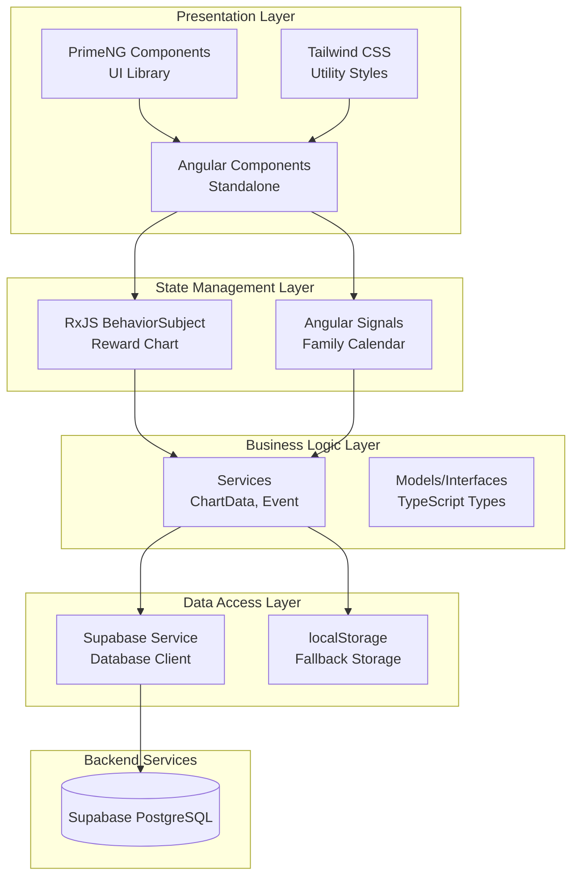

# System Architecture Diagram

## High-Level System Architecture

## Component Architecture - Reward Chart

## Component Architecture - Family Calendar

## Data Flow - Reward Chart

## Data Flow - Family Calendar

## Deployment Architecture

## Nx Project Graph

## Technology Stack Layers

